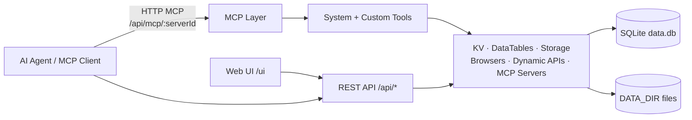
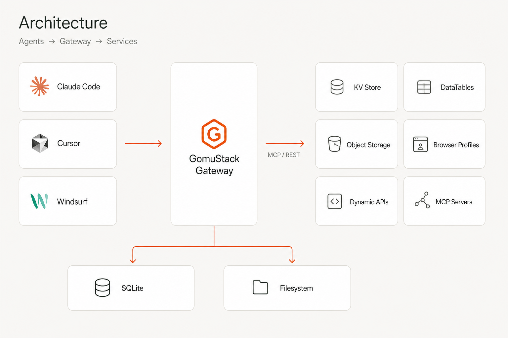
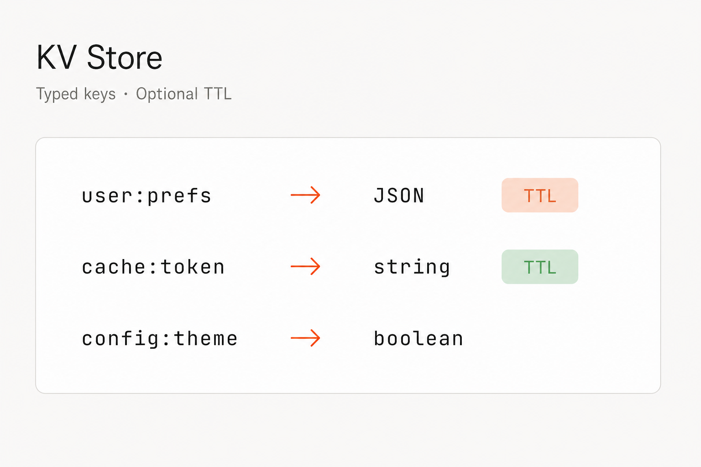
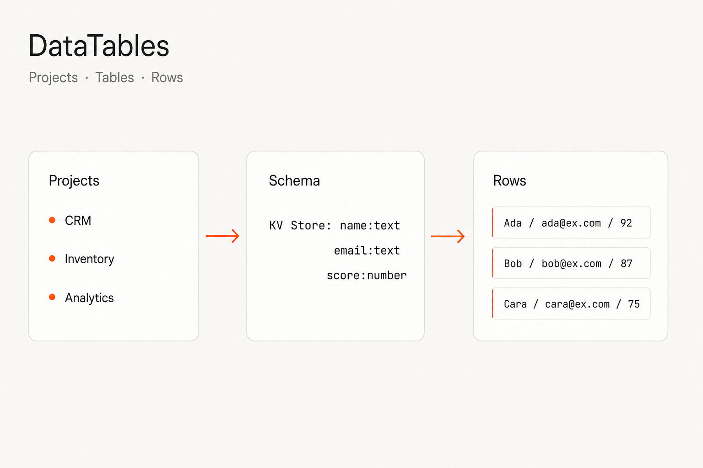
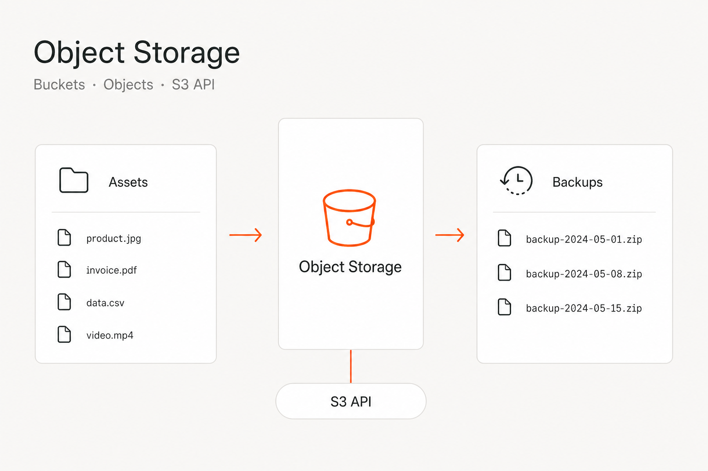
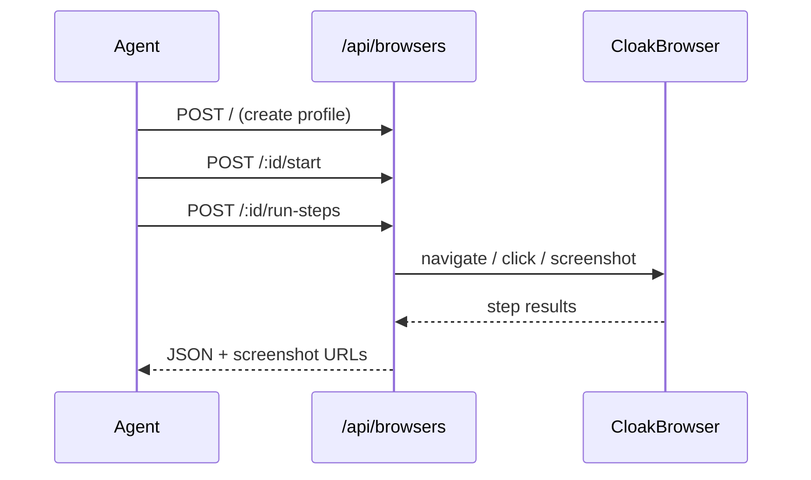
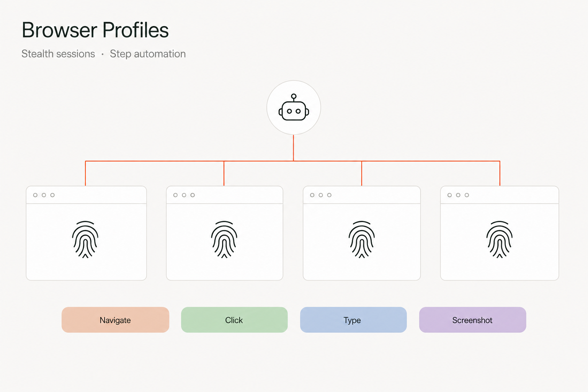
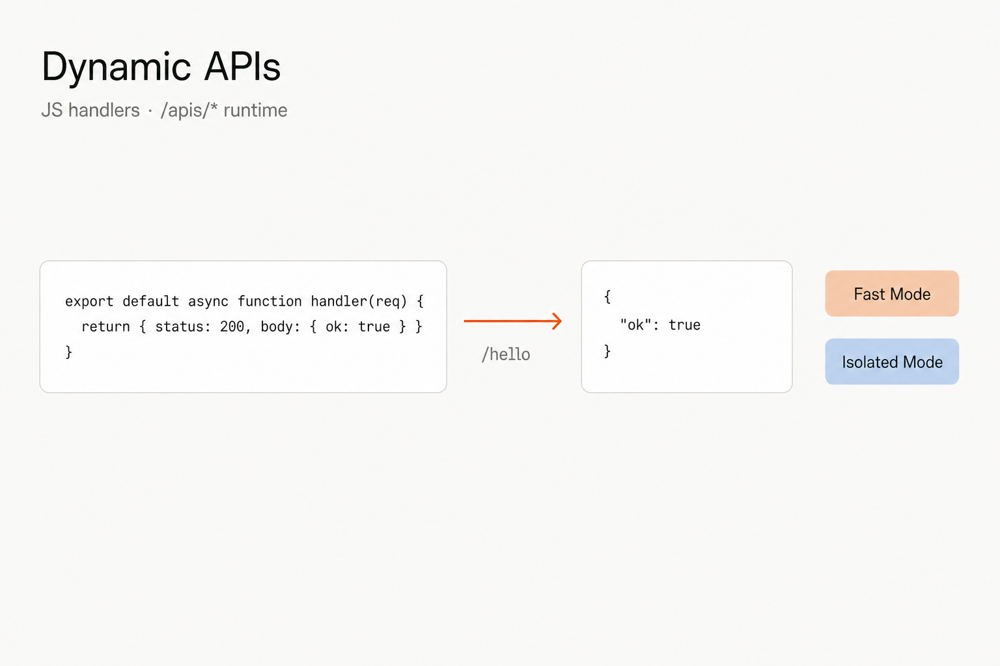

<p align="center">
  <h1 align="center">GomuStack</h1>
  <p align="center">
    <strong>LLM-first self-hosted backend — DataTables, MCP servers, S3-compatible storage, browsers, and dynamic APIs.</strong>
  </p>
  <p align="center">
    <a href="https://github.com/Zobite/gomustack/releases"></a>
    <a href="https://github.com/Zobite/gomustack/blob/main/LICENSE"></a>
    <a href="https://hub.docker.com/r/zobite/gomustack"></a>
    
    
  </p>
</p>

---

## What is GomuStack?

GomuStack is a self-hosted backend for AI coding agents (Claude Code, Cursor, Windsurf, etc.). It exposes persistent storage, browser automation, custom APIs, and tool servers through an **MCP Streamable HTTP endpoint** and a **REST API**.



<p align="center">
  
</p>

---

## Quick Start

### Option 1: Docker (Recommended)

```bash
docker run -d \
  --name gomustack \
  -p 5610:5610 \
  -v gomustack-data:/data \
  zobite/gomustack:latest
```

Open `http://localhost:5610` (redirects to `/ui`).

#### Docker Compose

```yaml
services:
  gomustack:
    image: zobite/gomustack:latest
    container_name: gomustack
    ports:
      - "5610:5610"
    environment:
      - HOST=0.0.0.0
      - PORT=5610
      - DATA_DIR=/data
    volumes:
      - gomustack-data:/data
    restart: unless-stopped
    logging:
      driver: json-file
      options:
        max-size: "10m"
        max-file: "3"

volumes:
  gomustack-data:
```

```bash
docker compose up -d
docker compose logs -f
docker compose down
```

---

### Option 2: From Source

> **Prerequisites:** [Bun](https://bun.sh) (latest)

```bash
git clone https://github.com/Zobite/gomustack.git
cd gomustack
bun install

# API + Vite UI (concurrently)
bun run dev
```

| Process | URL |
| ------- | --- |
| API | `http://127.0.0.1:5610` |
| Web (Vite) | `http://127.0.0.1:5611` (proxies `/api` to the API) |

```bash
bun run build
bun run start
```

Production serves the built UI at `http://127.0.0.1:5610/ui`.

---

### First-time Setup

On first visit, when no users exist, `GET /api/auth/setup-status` returns `{ "needsSetup": true }`. Create the first admin via the UI setup page or:

```bash
curl -X POST http://127.0.0.1:5610/api/auth/setup \
  -H 'Content-Type: application/json' \
  -d '{
    "username": "admin",
    "email": "admin@example.com",
    "password": "your-secure-password",
    "name": "Admin"
  }'
```

There are **no default credentials**. Password must be at least 8 characters. Subsequent access uses JWT (`Authorization: Bearer <access_token>`) or an API key (`X-API-Key` / `Authorization: Bearer <api-key>`).

### Environment Variables

| Variable   | Default (from-source)     | Description                          |
| ---------- | ------------------------- | ------------------------------------ |
| `PORT`     | `5610`                    | HTTP server port                     |
| `HOST`     | `127.0.0.1`               | Bind address (`0.0.0.0` in Docker)   |
| `DATA_DIR` | `~/.gomustack`            | Data directory (`/data` in Docker)   |

---

## Features

### KV Store

Flat key-value store with typed values (`string`, `number`, `boolean`, `json`), optional TTL (seconds), and upsert semantics. Keys are globally unique — use prefixes for namespaces.

<p align="center">
  
</p>

```bash
# Create / upsert
curl -X POST http://127.0.0.1:5610/api/kv-store \
  -H "Authorization: Bearer $TOKEN" \
  -H 'Content-Type: application/json' \
  -d '{"key":"app.theme","value":"dark","type":"string"}'

# Read by key
curl http://127.0.0.1:5610/api/kv-store/by-key/app.theme \
  -H "Authorization: Bearer $TOKEN"
```

**MCP Tools:** `kv_list`, `kv_get`, `kv_set`, `kv_delete`

### DataTables

Structured tables organized by projects. Dynamic columns (`text`, `number`, `date`, `boolean`), row CRUD, bulk update/delete, and filter operators for querying.

<p align="center">
  
</p>

```bash
# List projects
curl http://127.0.0.1:5610/api/datatables \
  -H "Authorization: Bearer $TOKEN"

# Create project
curl -X POST http://127.0.0.1:5610/api/datatables \
  -H "Authorization: Bearer $TOKEN" \
  -H 'Content-Type: application/json' \
  -d '{"name":"CRM","description":"Customer data"}'
```

**MCP Tools:** `datatables_list_projects`, `datatables_create_project`, `datatables_list_tables`, `datatables_create_table`, `datatables_update_table`, `datatables_add_column`, `datatables_update_column`, `datatables_delete_column`, `datatables_query_rows`, `datatables_get_row`, `datatables_insert_row`, `datatables_bulk_update_rows`, `datatables_bulk_delete_rows`

### Object Storage

Self-hosted object storage with buckets, upload/download, presigned URLs, access keys, and public file serving. S3-compatible API is available at `/s3` (path-style).

<p align="center">
  
</p>

```bash
# List buckets
curl http://127.0.0.1:5610/api/storage \
  -H "Authorization: Bearer $TOKEN"

# Create bucket
curl -X POST http://127.0.0.1:5610/api/storage \
  -H "Authorization: Bearer $TOKEN" \
  -H 'Content-Type: application/json' \
  -d '{"name":"uploads"}'
```

**MCP Tools:** `storage_list_buckets`, `storage_list_objects`, `storage_get_object_info`, `storage_get_download_url`, `storage_upload_object`, `storage_delete_object`

### Browser Profiles

Multi-session stealth browser via Playwright + CloakBrowser. Isolated profiles with fingerprint/proxy config and batch step actions (`navigate`, `click`, `type`, `screenshot`, `get_content`, …). Also supports ephemeral `browser_quick_run` without a saved profile.



<p align="center">
  
</p>

```bash
# List profiles
curl http://127.0.0.1:5610/api/browsers \
  -H "Authorization: Bearer $TOKEN"
```

**MCP Tools:** `browser_list`, `browser_create`, `browser_start`, `browser_stop`, `browser_delete`, `browser_list_tabs`, `browser_run_steps`, `browser_quick_run`

### Dynamic APIs

Serverless-style JS handlers mounted under `/apis/*`. Execution mode is auto-detected: **fast** (in-process) when there are no npm imports, **isolated** (Bun subprocess with auto-installed deps) when imports are present. Includes AI coding helpers in the UI.

<p align="center">
  
</p>

```bash
# Create endpoint
curl -X POST http://127.0.0.1:5610/api/dynamic-apis \
  -H "Authorization: Bearer $TOKEN" \
  -H 'Content-Type: application/json' \
  -d '{
    "name": "hello",
    "method": "GET",
    "path": "/hello",
    "isPublic": true
  }'

# Invoke runtime route
curl http://127.0.0.1:5610/apis/hello
```

**MCP Tools:** `dynamic_api_list`, `dynamic_api_get`, `dynamic_api_create`, `dynamic_api_update`, `dynamic_api_delete`

### MCP Tool Servers

Manage MCP servers and custom JS tools. Built-in server `mts_system` (`GomuStack`) exposes all system tools from `SYSTEM_TOOLS_REGISTRY`. Custom servers can add tools, optionally extend builtin tools, and authenticate with a per-server MCP API key.

**MCP endpoint shape:** `http://<host>:<port>/api/mcp/<server-id>`

**MCP Tools:** `mcp_server_list`, `mcp_server_get`, `mcp_server_create`, `mcp_server_update`, `mcp_server_delete`, `mcp_tool_list`, `mcp_tool_get`, `mcp_tool_create`, `mcp_tool_update`, `mcp_tool_delete`, `mcp_tool_test`

### LLM Providers

Admin-managed LLM provider configs for AI coding features. Supported types: `openrouter`, `openai`, `gemini`, `anthropic`, `ollama`, `custom` (OpenAI-compatible). Models can be refreshed from the provider API.

```bash
curl http://127.0.0.1:5610/api/llm-providers \
  -H "Authorization: Bearer $TOKEN"
```

### Auth, Users & API Keys

- **Auth** (`/api/auth`): login, refresh, change password, setup, me
- **Users** (`/api/users`): admin user management
- **API Keys** (`/api/api-keys`): scoped keys for REST access (`X-API-Key` or Bearer)

---

## Connect an MCP Client

Builtin system tools server ID: `mts_system`.

Generate or reveal the MCP server API key in the UI (**MCP Servers → Config**), then point your client at:

```
http://127.0.0.1:5610/api/mcp/mts_system
```

<details>
<summary><strong>Claude Code</strong></summary>

```bash
claude mcp add --transport http gomustack \
  http://127.0.0.1:5610/api/mcp/mts_system \
  --header "Authorization: Bearer <YOUR_MCP_KEY>"
```

</details>

<details>
<summary><strong>Cursor</strong></summary>

```json
{
  "mcpServers": {
    "gomustack": {
      "url": "http://127.0.0.1:5610/api/mcp/mts_system",
      "headers": {
        "Authorization": "Bearer <YOUR_MCP_KEY>"
      }
    }
  }
}
```

</details>

<details>
<summary><strong>Windsurf / other Streamable HTTP clients</strong></summary>

```json
{
  "mcpServers": {
    "gomustack": {
      "serverUrl": "http://127.0.0.1:5610/api/mcp/mts_system",
      "headers": {
        "Authorization": "Bearer <YOUR_MCP_KEY>"
      }
    }
  }
}
```

</details>

Legacy SSE is also available at `/api/mcp/:serverId/sse` + `/api/mcp/:serverId/messages` for older clients.

---

## API Overview

| Group | Prefix | Notes |
| ----- | ------ | ----- |
| Health | `/api/health` | Liveness + version |
| Auth | `/api/auth` | Login, refresh, setup, me |
| Users | `/api/users` | Admin user CRUD |
| API Keys | `/api/api-keys` | REST API keys |
| Configurations | `/api/configurations` | Key/value app config |
| System | `/api/system` | Version |
| KV Store | `/api/kv-store` | Variables |
| DataTables | `/api/datatables` | Projects, tables, rows |
| Storage | `/api/storage` | Buckets & objects |
| S3 API | `/s3` | S3-compatible path-style |
| Browsers | `/api/browsers` | Profiles & automation |
| Dynamic APIs | `/api/dynamic-apis` | Manage handlers |
| Dynamic runtime | `/apis/*` | Execute handlers |
| MCP Tool Servers | `/api/mcp-tool-servers` | Manage MCP servers/tools |
| MCP transport | `/api/mcp/:serverId` | Streamable HTTP (+ legacy SSE) |
| LLM Providers | `/api/llm-providers` | Provider configs (admin) |
| Web UI | `/ui` | SPA (production) |

---

## Tech Stack

| Component | Technology |
| --------- | ---------- |
| **Runtime** | [Bun](https://bun.sh) |
| **Server** | [Fastify](https://fastify.io) v5 + Zod |
| **Database** | SQLite via [Drizzle ORM](https://orm.drizzle.team) (`bun:sqlite`) |
| **MCP SDK** | [@modelcontextprotocol/sdk](https://github.com/modelcontextprotocol/typescript-sdk) |
| **Browser** | [Playwright](https://playwright.dev) (`playwright-core`) + [CloakBrowser](https://www.npmjs.com/package/cloakbrowser) |
| **AI** | [Vercel AI SDK](https://sdk.vercel.ai), [LangChain](https://js.langchain.com) |
| **Frontend** | [React](https://react.dev) 19 + [Vite](https://vitejs.dev) 8 |
| **UI** | [Ant Design](https://ant.design) 6 + [Tailwind CSS](https://tailwindcss.com) 4 |
| **Data Grid** | [AG Grid](https://www.ag-grid.com) |
| **Code Editor** | [Monaco Editor](https://microsoft.github.io/monaco-editor/) |
| **State** | [Zustand](https://zustand-demo.pmnd.rs) |

---

## Development

```bash
bun install

bun run dev            # server + web
bun run dev:server     # API only (watch)
bun run dev:web        # Vite only

bun run typecheck:server
bun run typecheck:web

bun run lint
bun run lint:fix
bun run format

bun run build          # web then server
bun run start          # production entry
```

Server tests: `cd src/server && bun test src/`

---

## Data Storage

Default `DATA_DIR` is `/data` in Docker and `~/.gomustack` locally:

```
DATA_DIR/
├── data.db                 # SQLite (metadata + all tables)
├── storage/                # Object storage files (by bucket)
├── browser-profiles/       # Browser profile user-data dirs
├── browser-screenshots/    # Temporary screenshots
├── api-sandboxes/          # Isolated Dynamic API sandboxes
├── mcp-tool-sandboxes/     # Isolated MCP tool sandboxes
├── tool-venvs/             # Optional tool virtualenvs
└── .cloakbrowser/          # CloakBrowser binary cache (Docker)
```

---

## License

[MIT](LICENSE) © [Zobite](https://github.com/Zobite)
